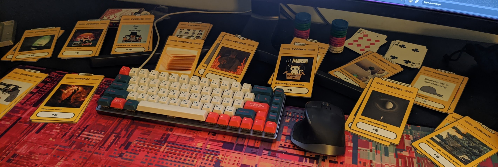
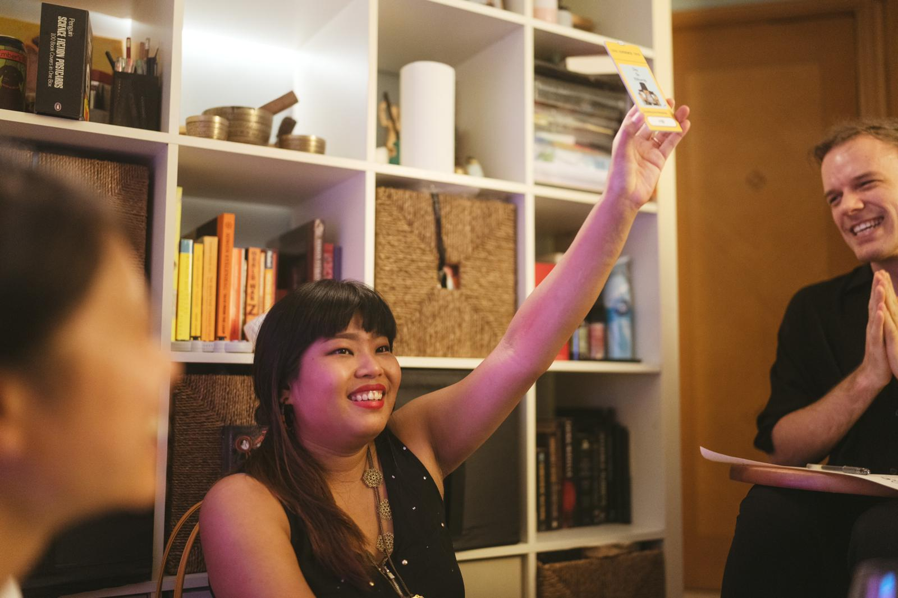

# The Trial

HUMANITY has been emiting such drab vibes into the aether that the COURT OF GALACTIC OPINION is considering whether Humanity should be *CANCELLED*. The COURT has sent an ADJUDICATOR to Earth who is calling on SHERIN for her expert testimony (oh shit!). 

Whether Sherin saves us... or drops the guillotine! all depends on the evidence she gathers from us!

All the players in the narrative represent artefacts from Earth that Sherin will be able to interact with and collect evidence from.

## Quest Items

The quest items are available through [Figma](https://www.figma.com/file/0tJ0M26kYCQXyxjpTKBE8i/Figma-Multiplayer-Dice-Games!-(Community)?node-id=95%3A0), or here in this repo in the [`quest item`](https://github.com/tijptjik/TheTrial/tree/main/quest%20items) directory.

## Gallery

The [gallery](https://photos.google.com/share/AF1QipMLxSvsZUB4iXvgS3Jh2xxSaWbKwoS_Ok9_eqOH7DGJ5V4KnNHIJu5KbjEBrF4-Pw?key=VThDS3NmVVNlNWRUUXEzb1RhRVVxa0RXbTdGUllB) of photos from the event if available on Google Photos. Special thanks to [Egill](https://egillbjarki.cargo.site/) for being the event's documentarian.

